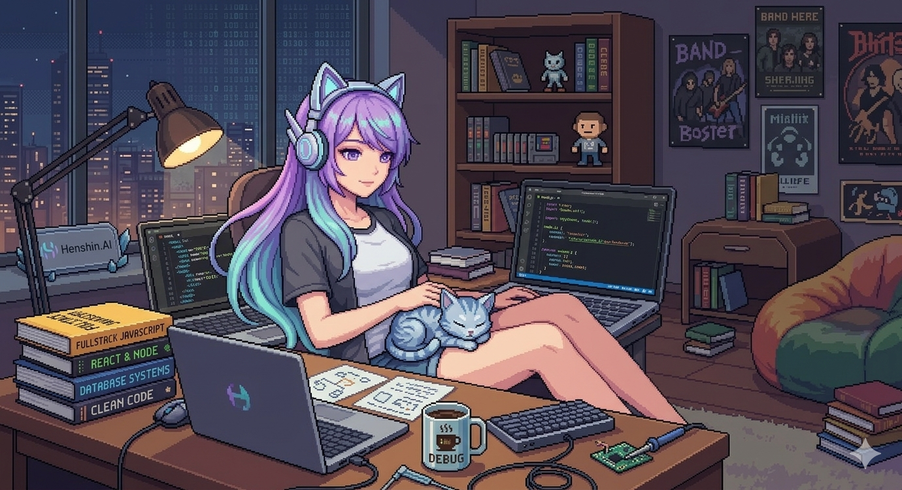

  
   
  <i>Esta é a Hina, mascote oficial do projeto Henshin.AI e representante da Hina Arena.</i>
 
  # 👋 Olá, eu sou o Felipe Gomes

  Sou **Desenvolvedor Fullstack**, focado em criar interfaces de alta performance e automações inteligentes.  
  Sigo os princípios de **Clean Code** e estou constantemente evoluindo no ecossistema **Node.js, React e TypeScript**.

  ---

  
  

---

## 🚀 Tecnologias e Ferramentas

### 💻 Front-end

### ⚙️ Back-end & Automação

### 🛠️ Testes & Ferramentas

---

## 🧩 Projetos em Destaque

### 🏟️ Hina Arena (Landing Page)
Interface de alta performance focada em conversão e experiência do usuário. Desenvolvida com foco em SEO, responsividade extrema e componentes reutilizáveis. Inclui um cronômetro de treino personalizado.

* 💻 **Repositório:** [github.com/FelipeGdasilva/hina-landing-page](https://github.com/FelipeGdasilva/hina-landing-page)

---

### 🤖 Henshin.AI
Projeto Fullstack que utiliza Inteligência Artificial e n8n para recomendar animes. Implementei fluxos resilientes usando IA para tratar variações de entrada de dados, garantindo que o workflow nunca quebre.

* 🚀 **Deploy:** [felipegdasilva.github.io/Henshin.AI/](https://felipegdasilva.github.io/Henshin.AI/)

---

### 🎮 Sonic Battle Universe
Experiência interativa de seleção de personagens inspirada em games. Atualmente sendo migrada para Next.js e Tailwind para otimização de performance.

* 🚀 **Deploy:** [felipegdasilva.github.io/Sonic-Battle-Universe/](https://felipegdasilva.github.io/Sonic-Battle-Universe/)
* 💻 **Repositório:** [github.com/FelipeGdasilva/Sonic-Battle-Universe](https://github.com/FelipeGdasilva/Sonic-Battle-Universe)

---

## 📊 Estatísticas do GitHub

  
  

---

## 📫 Contato
* **LinkedIn:** [linkedin.com/in/felipe-gomes-silva-dev](https://www.linkedin.com/in/felipe-gomes-silva-dev/)
* **E-mail:** [Seu E-mail Aqui]
